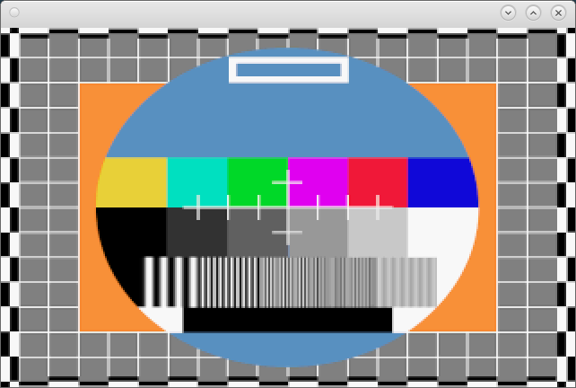
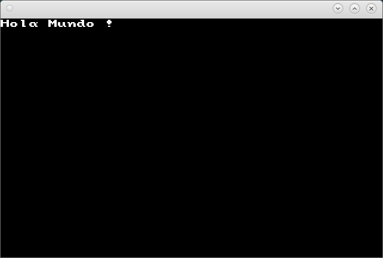
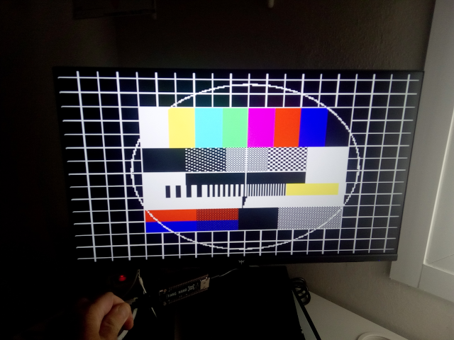

# Proyecto XaVI bits

XaVI bits representa 16 bits con numeros romanos y añadiendo una 'a' para poder
pronunciarlo. Con el proyecto pretendo crear un emulador en C de un procesador
de 16 bits, con modo protegido, con segmentación, muy sencillo, con apenas 64
instrucciones. Luego un pequeño ensamblador y quizas un pequeño OS de estilo
Unix, si consigo que funcione, podría intentar que funcionara en una FPGA, me he
comprado una Tang Nano 9k.

¿Por qué? Porque es divertido, ya sé que hay muchos proyectos similares, pero
creo que me voy a divertir, la Tang Nano 9k tiene una [PSRAM](https://github.com/zf3/psram-tang-nano-9k)
de 8MB y una [FLASH](https://learn.lushaylabs.com/tang-nano-9k-reading-the-external-flash/)
de 4MB con lo que se podría montar una computadora con salida [HDMI](https://github.com/vossstef/tang_nano_9k_vic20_hdmi)
y con alguna soldadura [USB](https://github.com/nand2mario/usb_hid_host), todo
en un solo circuito. Cierto que el resultado no puede ser muy potente, pero con
ejecutar programas ejemplo podría estar bien. En mapa de memoria sería el
siguiente:

| RAM 8MB  | Comentarios  |
| -------- | ------------ |
| 000 0000 | int 0 ilegal |
| 000 0004 | int 1 virtual|
|   ...    |              |
| 000 007c | int 31       |
| ... 4KB  |              |
| 001      |              |
| ...      |              |
| 100      |              |
| 200      |              |
| 300      |              |
| 400      |              |
| 500      |              |
| 600      |              |
| 700      | Screen       |
| 7e0      | 320x200x8 64KB 320x240x8 75KB 640x400x8 307KB 800x600x8 480KB |
| 7f0      | 1024x720x8 737KB 320x200x16 128KB 320x240x16 150KB |
|   ...    | 640x400x16 614KB 800x600x16 960KB 1024x720x16 1.474KB |
| ROM 4MB  |              |
|   c00    |              |
|   d00    |              |
|   e00    |              |
|   f00    |              |
|   fc0    | Boot         |
|   fd0    |              |
|   fe0    |              |
|   ff0    |              |

En los segmentos tendriamos en los bits menos significativos: limit 2 bits,
priv 1 bit, virtual 1 bit. Donde limit expresaria el tamaño del segmento 00
64Kb, 01 32Kb, 10 16Kb, 11 8Kb; donde privilege 0 privilegio, 1 no privilegio, y
virtual 0 no virtual, 1 virtual.

Tendriamos 8 registros generales de 16 bits: r0 el pc (contador de programa),r1
el sp (puntero de pila). Tendriamos tambien 8 segmentos: s0 segmento de
programa, s1 segmento de pila, s2 segmento de datos y el resto. Habria una
palabra de estado con los flags: o overflow, z zero, c carry, s sign. El juego
de instrucciones sería el siguiente:

| Instruccion|H | Descripcion | bits de parametros  | flags |
| -----------|--| ----------- | ------------------- | ----- |
| 0. 0000 00 |00| mul r7(desbordamiento)r6 <- r7*r6 | 0 |   |
| 1. 0000 01 |04| div r7(resto)r6 <- r7r6/r5	    | 0 | o |
| 2. 0000 10 |08| umul r7(desbordamiento)r6 <- r7*r6| 0 |   |
| 3. 0000 11 |0c| udiv r7(resto)r6 <- r7r6/r5       | 0 | o |
| 4. 0001 00 |10| ret                               | 0 |   |
| 5. 0001 01 |14| reti                              | 0 | p |
| 6. 0001 10 |18| neg r0                            | 3 | z c s |
| 7. 0001 11 |1c| not r0                            | 3 | z c s |
| 8. 0010 00 |20| load r0,r1                        | 6 |   |
| 9. 0010 01 |24| load r0,s0                        | 6 |   |
| 10. 0010 10|28| save r0,s0                        | 6 | p |
| 11. 0010 11|2c| int i5                            | 5 |   |
| 12. 0011 00|30| jmp i10                           | 10|   |
| 13. 0011 01|34| inport reg3 reg31 i1              | 8 | p |
|            |  | r0 <- r1+i16                      |   |   |
|            |  | r0 <- r1                          |   |   |
|            |  | r0 <- i16                         |   |   |
|            |  | r0 <- 0                           |   |   |
| 14. 0011 10|38| outport reg3 reg31 i1             | 8 | p |
|            |  | r0 -> r1+i16                      |   |   |
|            |  | r0 -> r1                          |   |   |
|            |  | r0 -> i16                         |   |   |
|            |  | r0 -> 0)                          |   |   |
| 15. 0011 11|3c| load bits reg3 seg3 reg31 i       | 10|   |
|            |  | r0 <- [s0:r1+i16]                 |   |   |
|            |  | r0 <- [s0:i16]                    |   |   |
| 16. 0100 00|40| load/jmp bits reg3 reg3 reg3 i1   | 10|   |
|            |  |   r0 <- [r1+r2+i16]               |   |   |
|            |  |   r0 <- [r1+r2]                   |   |   |
| 17. 0100 01|44| load/jmp bits reg3 reg31 i1       | 8 |   |
|            |  | r0 <- [r1+i16]                    |   |   |
|            |  | r0 <- [r1]                        |   |   |
|            |  |   r0 <- [i16]                     |   |   |
|            |  |   r0 <- [0]                       |   |   |
| 18. 0100 10|48| save bits reg3 seg3 reg31 i       | 10|   |
|            |  | r0 -> [s0:r1+i16]                 |   |   |
|            |  | r0 -> [s0:i16]                    |   |   |
| 19. 0100 11|4c| save bits reg3 reg3 reg3 i1       | 10|   |
|            |  | r0 -> [r1+r2+i16]                 |   |   |
|            |  | r0 -> [r1+r2]                     |   |   |
| 20. 0101 00|50| save bits reg3 reg31 i1           | 8 |   |
|            |  | r0 -> [r1+i16]                    |   |   |
|            |  | r0 -> [r1]                        |   |   |
|            |  | r0 -> [i16]                       |   |   |
|            |  | r0 -> [0]                         |   |   |
| 21. 0101 01|54| add bits reg3 reg3 i              | 6 | z c s |
|            |  | r0 <- r1+i16                      |   |   |
| 22. 0101 10|58| add bits reg3 reg3 reg3 i1        | 10| z c s |
|            |  | r0 <- r1+r2+i16                   |   |   |
|            |  | r0 <- r1+r2                       |   |   |
| 23. 0101 11|5c| adc bits reg3 reg3 i              | 6 | z c s |
|            |  | r0 <- r1+i16+carry                |   |   |
| 24. 0110 00|60| adc  bits reg3 reg3 reg3 i1       | 10| z c s |
|            |  | r0 <- r1+r2+i16+carry             |   |   |
|            |  | r0 <- r1+r2+carry                 |   |   |
| 25. 0110 01|64| sub bits reg3 reg3 i              | 6 | z c s |
|            |  | r0 <- r1-i16                      |   |   |
| 26. 0110 10|68| sub bits reg3 reg3 reg3 i1        | 10| z c s |
|            |  | r0 <- r1-r2-i16                   |   |   |
|            |  | r0 <- r1-r2                       |   |   |
| 27. 0110 11|6c| sbb  bits reg3 reg3 i             | 6 | z c s |
|            |  | r0 <- r1-i16-carry                |   |   |
| 28. 0111 00|70| sbb bits reg3 reg3 reg3 i1        | 10| z c s |
|            |  | r0 <- r1-r2-i16                   |   |   |
|            |  | r0 <- r1-r2                       |   |   |
| 29. 0111 01|74| cmp bits reg3 reg31 i1            | 8 | z c s |
|            |  | r0,r1-i16                         |   |   |
|            |  | r0,r1                             |   |   |
|            |  | r0,i16                            |   |   |
|            |  | r0                                |   |   |
| 30. 0111 10|78| and bits reg3 reg3 reg3 i1        | 10| z |
|            |  | r0 <- r1&r2&i16                   |   |   |
|            |  | r0 <- r1&r2                       |   |   |
| 31. 0111 11|7c| or bits reg3 reg3 reg3 i1         | 10| z |
|            |  | r0 <- r1|r2|i16                   |   |   |
|            |  | r0 <- r1|r2                       |   |   |
| 32. 1000 00|80| xor bits reg3 reg3 reg3 i1        | 10| z |
|            |  | r0 <- r1^r2^i16                   |   |   |
|            |  | r0 <- r1^r2                       |   |   |
| 33. 1000 01|84| shl r0,r1<r2                      | 9 | z c s |
| 34. 1000 10|88| shl r0,r1<i4                      | 10| z c s |
| 35. 1000 11|8c| shr r0,r1>r2                      | 9 | z c s |
| 36. 1001 00|90| shr r0,r1>i4                      | 10| z c s |
| 37. 1001 01|94| sar r0,r1>r2                      | 9 | z c s |
| 38. 1001 10|98| sar r0,r1>i4                      | 10| z c s |
| 39. 1001 11|9c| jb i10                            | 10|   |
| 40. 1010 00|a0| jbe i10                           | 10|   |
| 41. 1010 01|a4| je i10                            | 10|   |
| 42. 1010 10|a8| jne i10                           | 10|   |
| 43. 1010 11|ac| ja i10                            | 10|   |
| 44. 1011 00|b0| jae i10                           | 10|   |
| 45. 1011 01|b4| jl i10                            | 10|   |
| 46. 1011 10|b8| jle i10                           | 10|   |
| 47. 1011 11|bc| jg i10                            | 10|   |
| 48. 1100 00|c0| jge i10                           | 10|   |
| 49. 1100 01|c4| load r0,u16                       | 3 jmp u16=load r0,u16|   |
| 50. 1100 10|c8| cli                               | 0 | p |
| 51. 1100 11|cc| sti                               | 0 | p |
| 52. 1101 00|d0| push r0                           | 3 |   |
| 53. 1101 01|d4| pop r0                            | 3 |   |
| 54. 1101 10|d8| call bits reg3 reg3 i1            | 10|   |
|            |  | [r1+r2+i16]                       |   |   |
|            |  | [r1+r2]                           |   |   |
| 17. 1101 11|dc| call bits reg31 i1                | 8 |   |
|            |  | [r1+i16]                          |   |   |
|            |  | [r1]                              |   |   |
|            |  | [i16]                             |   |   |
|            |  | [0]                               |   |   |
| 56. 1110 00|e0| jmps bits seg3 i                  | 3 |   |
|            |  | s0:u16                            |   |   |
| 57. 1110 01|e4| ssave bits seg3 seg3              | 6 |   |
|            |  | s0<->s1                           |   |   |
| 58. 1110 10|e8| calls bits seg3 i                 | 3 |   |
|            |  | s0:u16                            |   |   |
| 59. 1110 11|ec| jo i10                            | 10|   |
| 60. 1111 00|f0| jno i10                           | 10|   |
| 61. 1111 01|f4| rets                              | 0 |   |
| 62. 1111 10|f8| ssave bits seg(reg3),seg3         | 6 |   |
|            |  | s(r0)<->s1                        |   |   |
| 63. 1111 11|fc| call u16                          | 0 |   |

## Estado del proyecto

He desarrollado, sin muchos test, un emulador de la CPU con la pantalla, un ensamblador y se pueden
ejecutar algunos ejemplos, como cargar una imagen binaria y escribir en pantalla con una fuente 8x8...

Tambien he comenzado con la Tang Nano 9k, y el proyecto [HDMI_testikuva](https://github.com/juj/HDMI_testikuva/) y lo he adaptado para la 9k.

